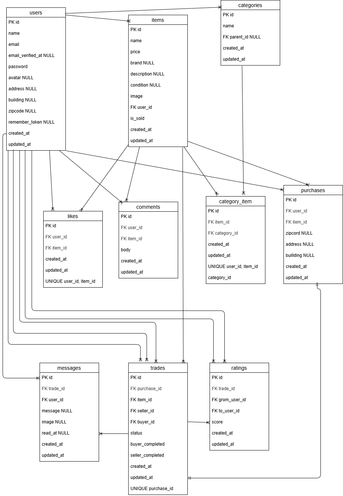

# フリマアプリ

## 概要

Laravelを使用して作成したフリマアプリです。

会員登録、ログイン機能、ログアウト機能、商品一覧取得、マイリスト一覧取得、商品検索機能、商品詳細情報取得、いいね機能、コメント送信機能、商品購入機能、支払方法選択機能、配送先変更機能、ユーザー情報取得、ユーザー情報変更、出品商品情報登録などを実装しています。

今回の課題では以下の機能を追加しました。

- 取引中商品の確認
- 取引チャット機能
- メッセージ送信（テキスト・画像）
- メッセージ編集・削除
- 未読通知表示
- 新着メッセージ順の並び替え
- 取引完了後の評価機能
- 取引完了時のメール通知機能

## 作成した目的

COACHTECHの課題として、既存のフリマアプリに取引チャット機能と関連機能を追加実装するために作成しました。

## 環境構築

### Dockerビルド

```bash
git clone https://github.com/higashi0414/freemarket-app.git
cd freemarket-app
docker compose up -d --build
```

# Laravel環境構築

```bash
docker compose exec php bash
composer install
cp .env.example .env  # 環境変数はDocker構成に合わせて設定済みです
php artisan key:generate
php artisan migrate
php artisan db:seed
php artisan storage:link
```

※ 画像表示のために storage:link を実行してください

# 使用技術

- Laravel 8.83.29
- PHP 8.2
- MySQL 8.0.26
- nginx　1.21.1
- Docker / VS Code / Ubuntu
- Laravel Fortify
- phpMyAdmin

# ER図



# メール確認

MailHogを使用しています。
以下のURLから送信メールを確認できます。
MailHog: http://localhost:8025

# 動作確認用URL

トップページ：http://localhost/
会員登録：http://localhost/register
ログイン：http://localhost/login
phpMyAdmin：http://localhost:8080/
MailHog: http://localhost:8025
