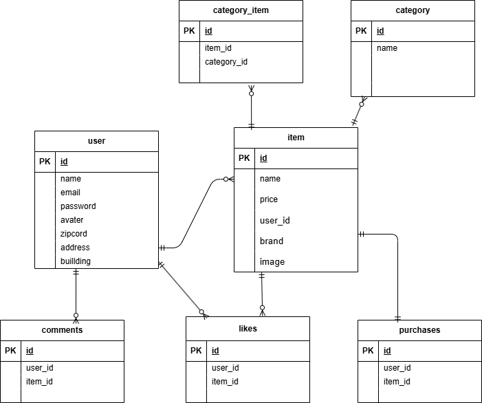

# フリマアプリ

# 概要
Laravelを使用して作成したフリマアプリです。
会員登録登録、ログイン機能、ログアウト機能、商品一覧取得、マイリスト一覧取得、商品検索機能、商品詳細情報取得、いいね機能、コメント送信機能、商品購入機能、支払方法選択機能、配送先変更機能、ユーザー情報取得、ユーザー情報変更、出品商品情報登録など実装しています。

# 環境構築
Dockerビルド
git clone
docker-compose up -d --build

# Laravel環境構築
docker-compose exec php bash
composer install
cp .env.example .env  # 環境変数はDocker構成に合わせて設定済みです
php artisan key:generate
php artisan migrate
php artisan db:seed

# 使用技術
Laravel 8.83.29
PHP 8.2
MySQL 8.0.26
nginx　1.21.1
Docker / VS Code / Ubuntu
Laravel Fortify
phpMyAdmin

# ER図

# 環境開発
トップページ：http://localhost/
会員登録：http://localhost/register
ログイン：http://localhost/login
phpMyAdmin：http://localhost:8080/
